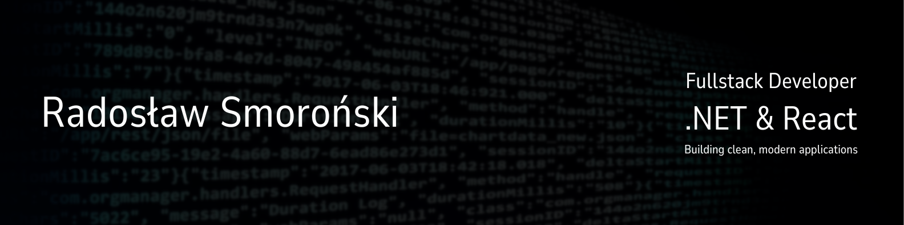

  

3rd-year CS student at WSEI Kraków, focused on backend development within the .NET ecosystem. For the past 2.5 years, I've been building applications with a focus on Clean Architecture, testability, and modern C# features.

### 🛠 Tech & Tools
* **Backend:** C# 14, .NET 10, ASP.NET Core, SignalR, EF Core
* **Architecture:** Clean Architecture, CQRS (MediatR), REST APIs
* **Testing:** xUnit, FluentAssertions, FakeItEasy
* **Frontend:** React, TypeScript, Vue.js, Bootstrap
* **DevOps:** Docker, Docker Compose, CI/CD, PostgreSQL

### 🚀 Key Projects
* **[Communicator](https://github.com/RadoslawSmoronski/communicator)** – Real-time 1-to-1 chat backend. Implemented with .NET 10, Clean Architecture, and SignalR. Features JWT auth with refresh tokens and multi-device support.
* **[ManageMe](https://github.com/RadoslawSmoronski/ManageMe)** – Project management tool. Currently a React + TS frontend, with a .NET 10 backend migration in progress.
* **[Portfolio](https://github.com/RadoslawSmoronski/portfolio)** – Dynamic website built with ASP.NET Core MVC and PostgreSQL.

---

### 📫 Let's Connect!
- **LinkedIn:** [in/radoslawsmoronski](https://linkedin.com/in/radoslawsmoronski)
- **Website:** [rsmoronski.pl](https://rsmoronski.pl/)
- **Email:** email@rsmoronski.pl

*"Consistent progress is my mantra – check out my contribution graph below!"*